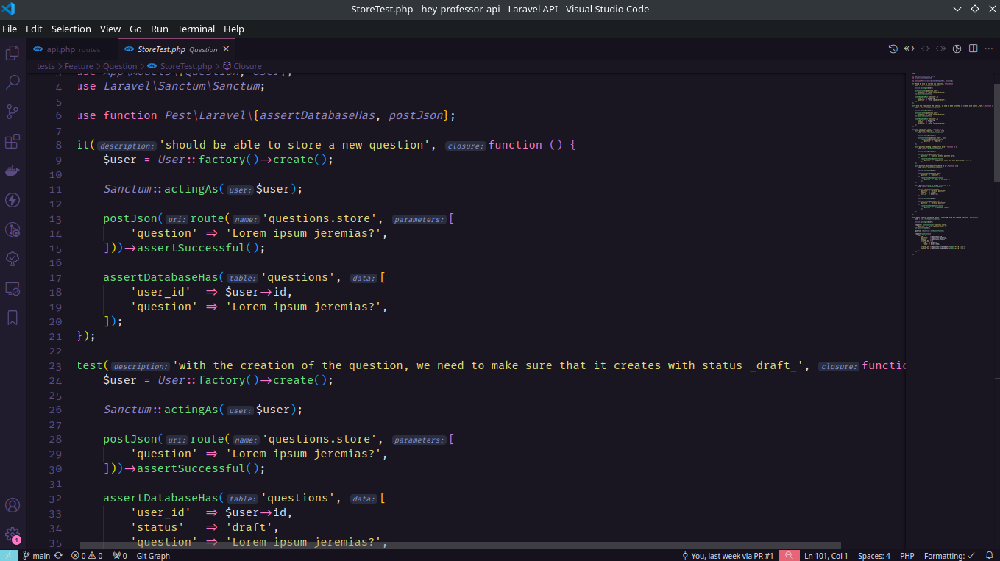
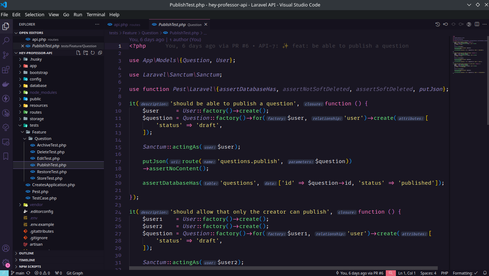

# Hey Professor API

| | |
| --- | --- |
|  | 

### 📕 Description
This project aims to create a list of questions so that people can vote for the best questions.

Project includes creating a database of questions, a voting system so people can vote for the best questions, and a web interface so people can access the list of questions and vote.

### 💻 Techinologies Used
- Pest
- Laravel Sail
- Github CI/CD
- Laravel Sanctum
- PostgreSQL
- Pint
- Husky
- PHPStan
